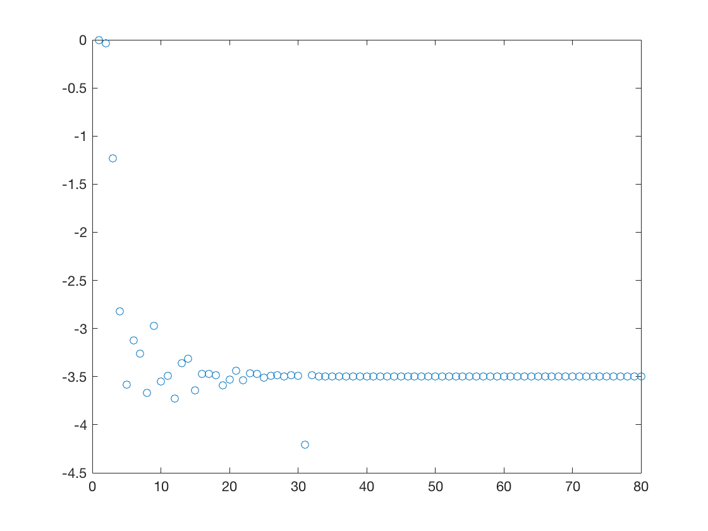
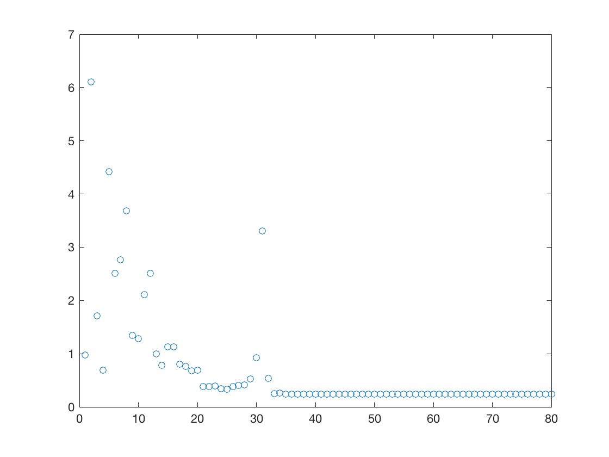

# 一个简单的GAN示例

by Xdestiny. 8/29/2018

## 简介

本代码展示了一个用于修改以为函数分布的GAN网络。网络结构主要参考了[https://github.com/devnag/pytorch-generative-adversarial-networks](https://github.com/devnag/pytorch-generative-adversarial-networks)，并用tensorflow+tenserlayer进行了实现

## 运行环境

以下为本人使用的环境，其他环境未做实验  
python 3.6.4  
numpy 1.13.3  
tensorflow 1.6.0  
tensorlayer 1.8.5  

## 运行结果

代码中展示了如何训练一个能将均匀分布变为特定正态分布的GAN网络。  
当设定正态分布均值为-3.5，方差为0.25的时候，训练过程中GAN生成分布的平均值与方差如下

